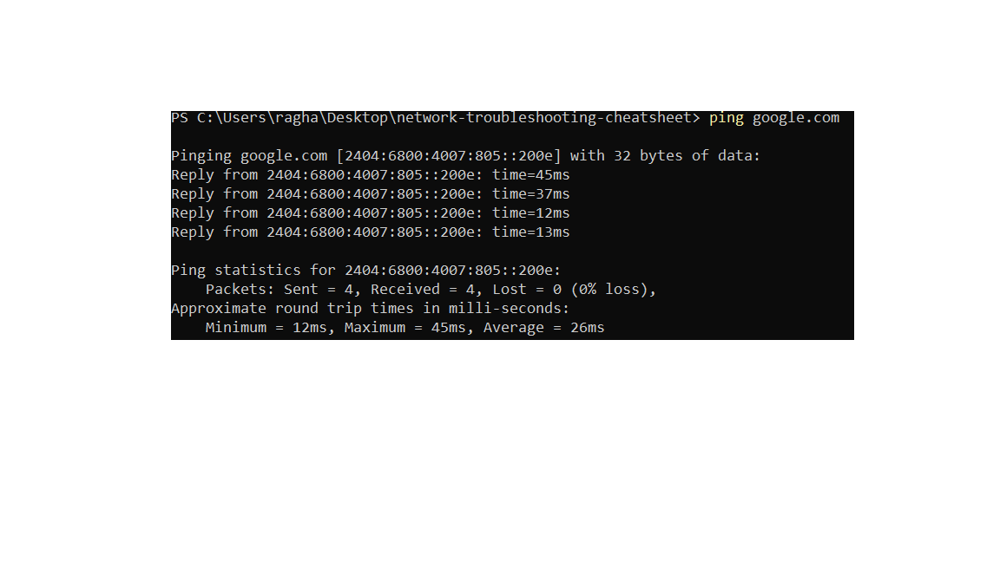

# Network Troubleshooting Cheatsheet

This project is a simple **Markdown-based cheatsheet** for basic network troubleshooting commands.  
It demonstrates how support engineers can quickly use CLI tools to diagnose connectivity, DNS, and routing issues.  

---

## 🔹 Features
- Common networking commands for **Windows, Linux, and macOS**  
- Includes **sample outputs** for each command  
- Helps in diagnosing **connectivity and DNS issues**  

---

## 🔹 Commands

### 1. Ping
```bash
ping google.com
```

Use: Tests connectivity to a host.

Sample Output:
```Python
Pinging google.com [142.250.182.14] with 32 bytes of data:
Reply from 142.250.182.14: bytes=32 time=15ms TTL=116
```

---

### 2. Traceroute
```bash
traceroute google.com   # Linux / macOS
tracert google.com      # Windows
```
Use: Shows path packets take to a host.

Sample Output:
```scss
1  router.local (192.168.1.1)  2.3 ms
2  isp.gateway (203.0.113.1)   8.1 ms
3  142.250.182.14              15.6 ms
```

---

### 3. IP Config/IF Config
```bash
ipconfig      # Windows
ifconfig      # Linux/macOS
```
Use: Displays IP address and network interfaces.

Sample Output:
```nginx
IPv4 Address. . . . . . . . . . . : 192.168.1.10
Subnet Mask . . . . . . . . . . . : 255.255.255.0
Default Gateway . . . . . . . . . : 192.168.1.1
```

---

### 4. DNS Lookup
```bash
nslookup google.com
```
Use: Checks DNS resolution.

Sample Output:
```yaml
Non-authoritative answer:
Name:    google.com
Address: 142.250.182.14
```

---

### 5. Extra Tools
-  netstat -an → Show open ports and active connections
-  curl -I https://example.com → Test HTTP headers
-  dig google.com (Linux) → Detailed DNS query

---

## 🔹 Why This Project Matters
Networking issues are some of the most common problems in technical support.
This cheatsheet provides a quick reference to:
- Test connectivity
-  Diagnose DNS issues
-  Understand routing problems
-  Identify open connections
By practicing these commands, one gains confidence in **network troubleshooting fundamentals**.

---

## 🔹 Example Screenshot



---

👨‍💻 Author: **Raghav Yadav**  
📌 GitHub: [beingralph](https://github.com/beingralph)
